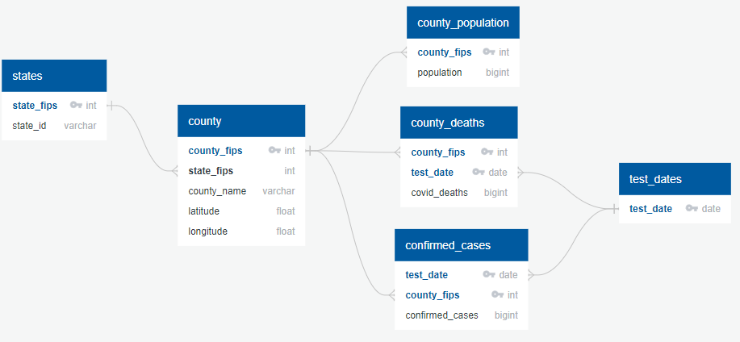

# Cov2
## by Michael Dowlin
## 4/18/20

### Description
This project used Covid-19 related data put together by the folks at usafacts.org.  There are 3 datasets available daily: # of confirmed cases, # of covid-related deaths and the current population estimates by county.  The confirmed case and death counts are by county and date (cumulative).  You can find out more about the data here: [USA Facts](https://usafacts.org/)

Once imported, I used Google Maps API to geocode the almost 3,200 counties to get latitude/longitude.  The data is then imported into a relational PostgreSQL database.  I used python and SQL to munge the data and create a clean csv file for use in Tableau and other tools.

The purpose of this dataset is to explore the daily rate of change in confirmed cases by county.  Eventually I will bring in weather data for more analysis as well.  See if there are correlations of a change in confirmed cases to weather, population density or other factors.

### Link to Tableau Dashboard
[Covid-19 Dashboard](https://public.tableau.com/profile/michael8262#!/vizhome/Cov2_15873184048850/Dashboard1?publish=yes)

### Images

*PostgreSQL covid_db Entity Relationship Diagram (ERD)

### Tools Needed to Create
|Tool   |Description                                                                                                          |
|-------|---------------------------------------------------------------------------------------------------------------------|
|PostgreSQL|It's a free relational database tool. [PostgreSQL](https://www.postgresql.org/)|
|python|This project uses Jupyter lab, and various other Python tools such as Pandas (see import_data notebook for all modules needed)|
|Goolge Maps Api Key|Register and get a free Goolge maps API key, you will need it to geo-code the counties [Get Google Maps Key](https://developers.google.com/maps/documentation/geocoding/get-api-key)|

### Steps to Create
|Step #|            |                                                                                                           |
|---|------------|-----------------------------------------------------------------------------------------------------------|
|1  |Setup PostgreSQL DB|Create a database called covid_db|
|2  |Run sql script "covid_db_ddl.sql"|Run the script to create the tables|
|3  |Run the sql script "views.sql"|This will create the database views that will be used by Python|
|4  |Run the jupyter notebook import_data.ipynb|This will take the raw CSV files and import them into the database and create a clean file for use in Tableau|

### Contents
| File                        | Description                                                                                     |
|-----------------------------|-------------------------------------------------------------------------------------------------|
|data\raw\covid_confirmed_usafacts.csv|File has number of Covid 19 confirmed cases by county and date.|
|data\raw\covid_county_population_usafacts.csv|File has county population estimates (current only)|
|data\raw\covid_deaths_usafacts.csv|File has Covid 19 related deaths by county and date.|
|data\clean\confirmed_cases_daily.csv|File created by Python notebook, this will be used by Tableau|
|docs\project_notes.docx|Project notes and ramblings|
|notebooks\import_data.ipynb|Notebook used to import the raw csvs into the PostgreSQL database, and create the file for Tableau|
|sql\covid_db_ddl.sql|This will create the tables and constraints in the PostgreSQL database|
|sql\views.sql|This script creates the views that will be used by Python pandas to work with the data, and eventually for use in Tableau|
